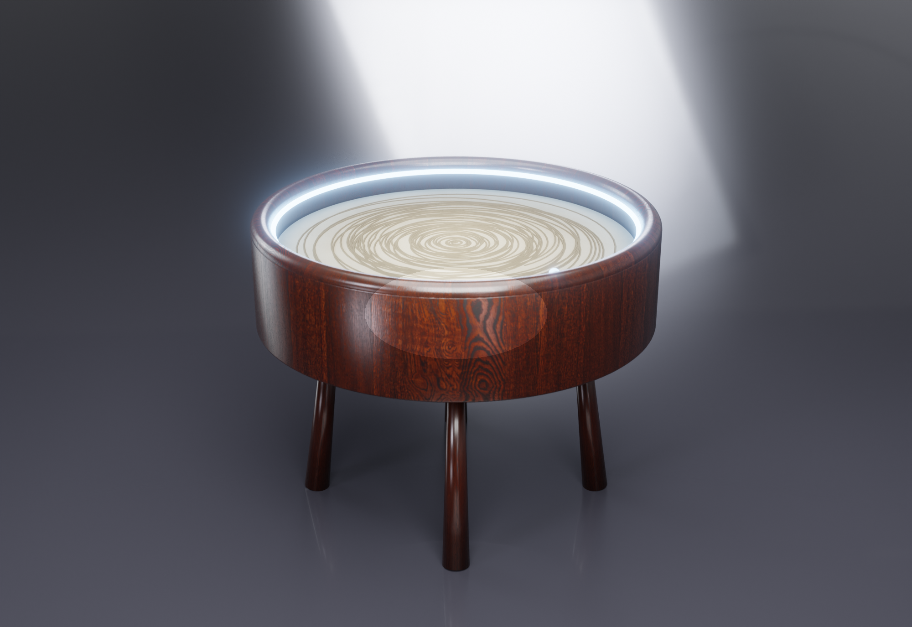

<div align="center">


### Kinetik Kum Sanatı Masası · Polar (θ-ρ) · Ø60 cm

Çelik bir bilyeyi kumun altından mıknatısla sürükleyerek sonsuz desen çizen,
**Türkiye'de üretilebilir**, açık tasarımlı premium kinetik sanat masası.




</div>

---

## Bu nedir?

DEVRAN, cam yüzeyin altında dönen bir kol (**θ** ekseni) ve kol üzerinde kayan bir taşıyıcının
(**ρ** ekseni) bir **N52 mıknatısı** taşıdığı, bu mıknatısın üstteki kumda bir **çelik bilyeyi**
sürükleyerek desen kazıdığı bir Sisyphus tipi kinetik masadır. Kenardaki **WS2812B LED halka**
ambiyans ışığı verir. Beyin bir **ESP32 + FluidNC**'dir; `.thr` (theta-rho) desenlerini oynatır.

Bu repo **fikirden satılabilir ürüne** giden tüm mühendislik + üretim dosyalarını içerir.

## Öne çıkanlar

- 🌀 Sonsuz, tekrarsız kinetik kum deseni (Atatürk imzası, spiral, özel)
- 🔇 Sessiz çalışma (TMC2209) · 💡 adreslenebilir LED ambiyans
- 📶 Wi-Fi / WebUI kontrol · SD desen kütüphanesi
- 🪵 Premium ceviz gövde + temperli cam · 🇹🇷 yerli üretilebilir
- 🔓 Açık kaynak yazılım (FluidNC + Dune Weaver)

## Üretim paketi

| Alan | Dosyalar |
|---|---|
| **Kontrol kartı** | KiCad Rev-B · Gerber · STEP · [JLCPCB paketi](hardware/pcb/jlcpcb/) (BOM+CPL) · [inceleme](docs/uretim/PCB_inceleme.md) |
| **Mekanizma** | [θ/ρ kinematik + kesit + hesap](docs/uretim/mekanizma_tasarim.md) |
| **Mekanik üretim** | [DXF + STEP](docs/uretim/dxf/) (şasi/ayak/kol) · [teknik çizim](docs/uretim/MONTAJ_CIZIM.pdf) · [montaj](docs/uretim/montaj.md) |
| **Elektrik** | [harness + pinout](docs/uretim/elektrik_montaj.md) · [talimat PDF](docs/uretim/ELEKTRIK_TALIMATI.pdf) · [QA/FCT](docs/uretim/QA_kontrol_listesi.md) |
| **Firmware** | [FluidNC config](firmware/fluidnc_config.yaml) · [mimari](firmware/README.md) |
| **İş** | [üretim dosyası (NPI)](docs/uretim/URETIM_DOSYASI.md) · [datasheet](docs/DEVRAN_datasheet.pdf) · [pitch](docs/DEVRAN_pitch.pdf) · [BOM/maliyet](docs/uretim/BOM_uretim.md) |
| **Görsel** | render + reklam videosu (`render/`) · interaktif 3D sim (`render/viewer.html`) |

> 🌐 **Web sitesi:** kök `index.html` (yerel: `python3 -m http.server`) — GitHub Pages açılırsa canlı.

## Durum (dürüst)

| Alt sistem | Durum |
|---|---|
| Mekanik tasarım | 🟡 Tasarlandı (kinematik + çizim + DXF/STEP) — fiziksel prototip yok |
| Kontrol kartı (PCB) | 🟠 Rev-B, DRC temiz — **fiziksel üretilmedi/test edilmedi** |
| Firmware | 🟠 Mimari + config hazır — cihazda doğrulanmadı |
| BOM / maliyet / görsel | 🟢 Hazır |

**Sıradaki:** Fusion'da COTS fit doğrulama → PCB sipariş → bring-up → kalibrasyon → EVT/DVT.

## Maliyet & fiyat

Seri COGS ≈ **7.800 TL** (~$230) → hedef **MSRP ≈ 21.900 TL** (~$650, ~%64 brüt marj).
Benzer ürün $699. Yazılım açık kaynak (0 TL). Detay: [BOM/maliyet](docs/uretim/BOM_uretim.md).

## Repo yapısı

```
hardware/pcb/   KiCad tasarım, Gerber, STEP, JLCPCB paketi (üretim scriptleri)
firmware/       FluidNC config + desen üreteçleri (.thr)
render/         Blender sahne (scene.py), render'lar, reklam videosu, 3D sim (viewer.html)
docs/uretim/    mekanizma, montaj, elektrik, QA, BOM, DXF+STEP, teknik çizim/PDF'ler
docs/           datasheet, pitch, gerçeklik yol haritası
*.html          web sitesi (build_site.py ile MD'den üretilen sayfalar dahil)
```

## Yeniden üretmek

```bash
# Site (MD -> HTML sayfalar)        : python3 build_site.py
# Render/video (Blender 4.5)        : Blender --background --python render/scene.py -- hero|video
# PCB (KiCad 9 + Freerouting)       : hardware/pcb/freeroute.sh
# DXF/STEP                          : python3 docs/uretim/dxf/make_dxf.py && make_step.py
# Datasheet/pitch                   : python3 docs/marka_pdf.py
```

## Lisans & katkı

Açık kaynak tasarım. Ticari üretim için: PCB **fiziksel doğrulama** + **CE/elektrik güvenlik**
belgesi gereklidir. Katkı/issue/PR memnuniyetle. Tüm değişiklikler: [CHANGELOG.md](CHANGELOG.md).

<div align="center"><sub>DEVRAN · kinetik kum sanatı masası · github.com/emirhan-yakar/kinetic-sand-table</sub></div>
