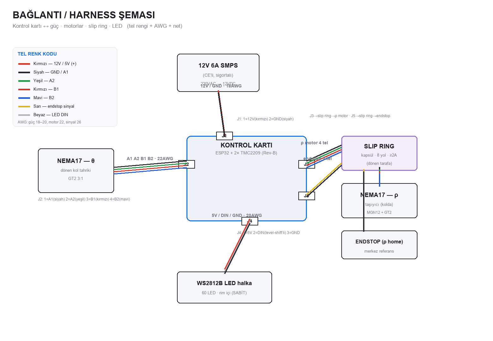

# Elektrik Montaj Talimatı (Electrical Work Instruction)

> ⚠️ **220 VAC** ile çalışılır. Mains bağlantılarını **yetkili** yapsın. Topraklama zorunlu.
> Kart **ESD**'ye duyarlı — topraklı bileklik kullanın. Tüm bağlantılar **güç KAPALI** yapılır.

Materyal/mekanik montaj **ayrı** sayfadadır: [`montaj.md`](montaj.md) (+ IKEA PDF: `MONTAJ_KILAVUZU.pdf`).

---

## 1) Konnektör pinout (kontrol kartı)
Kart üzeri konum (mm, kart orijinine göre) + tel:

| Konnektör | Konum | Pin → Net | Tel (renk · AWG) | Gider |
|---|---|---|---|---|
| **J1** güç | (6, 60) | 1=12V · 2=GND | kırmızı/siyah · 18 | 12V SMPS |
| **J2** θ motor | (6, 6) | 1=A1 2=A2 3=B1 4=B2 | siyah/yeşil/kırmızı/mavi · 22 | NEMA17 θ (gövde içi) |
| **J3** ρ motor | (72, 6) | 1=A1 2=A2 3=B1 4=B2 | siyah/yeşil/kırmızı/mavi · 22 | **slip ring → ρ motor** |
| **J4** LED | (66, 60) | 1=5V 2=DIN 3=GND | kırmızı/beyaz/siyah · 20 | WS2812B halka (level-shifter’lı) |
| **J5** endstop | (40, 6) | 1=3V3 2=SİNYAL 3=GND | —/sarı/siyah · 26 | **slip ring → endstop** |

> NEMA17 faz eşlemesi modele göre değişir — **bobin çiftlerini ohmmetre ile doğrula**
> (aynı bobinin iki ucu ~2–4 Ω; çiftler arası açık devre). Yanlış çift → motor titrer/dönmez.

## 2) Slip ring tel haritası (8 yollu kapsül)
ρ motoru kolla döndüğü için kablosu slip ring’ten geçer (stator=baz, rotor=kol):

| Slip ring teli | Sinyal | Stator ucu | Rotor ucu |
|---|---|---|---|
| W1 | ρ A1 | J3-1 | ρ motor A1 |
| W2 | ρ A2 | J3-2 | ρ motor A2 |
| W3 | ρ B1 | J3-3 | ρ motor B1 |
| W4 | ρ B2 | J3-4 | ρ motor B2 |
| W5 | endstop sinyal | J5-2 | endstop sinyal |
| W6 | GND (lojik) | J5-3 | endstop GND |
| W7,W8 | yedek | — | — |

> Sürücüler **bazda** (PCB’de) — slip ring **motor akımı** (~0.8A) taşır; ≥2A/yol şart.
> LED **sabit** rim’de → slip ring’e **girmez**.

## 3) Montaj sırası (elektrik)
1. **SMPS girişi (mains):** 220VAC L/N + **topraklama (PE)** → SMPS; giriş hattına **sigorta**.
   Mains kablolarını **ferrül + yalıtım**; gövdeye gerilim aktarımı yok.
2. **12V → J1:** SMPS 12V(+)/GND → J1 (kırmızı/siyah 18AWG). Polariteyi doğrula (karttaki ters-polarite
   koruması yedektir, yine de doğru bağla).
3. **θ motor → J2:** bobin çiftlerini ohmmetre ile bul, A1A2/B1B2 sırasıyla bağla.
4. **Slip ring:** stator W1–W6 → J3 (4) + J5 (2); rotor W1–W6 → ρ motor (4) + endstop (2).
   Slip ring’i dönme ekseninde merkeze sabitle; rotor kablosunu kola, stator kablosunu baza.
5. **LED → J4:** 5V/DIN/GND. DIN karttaki **level-shifter** çıkışından; ilk LED’e gider.
   LED gücü ayrı 5V hattıyla beslenebilir (60 LED tam beyaz ~3.6A).
6. **Kablo yönetimi:** spiral/kanal, **gerilim azaltıcı (strain relief)**, dönen kol kablosuna
   **bükülme payı** (slip ring’e kadar serbest döner). Tüm kabloları **etiketle**.

## 4) İlk güç verme (motor BAĞLAMADAN)
Önce QA listesi §2: 12V/5V/3V3 ölçümü + ESP32 boot. **Sonra** motorları bağla.
→ Tam prosedür: [`QA_kontrol_listesi.md`](QA_kontrol_listesi.md)

## 5) Güvenlik / CE
- Mains izolasyonu, **PE topraklama** sürekliliği (<0.1Ω), çift yalıtım veya topraklı gövde.
- Sigorta (giriş), SMPS **CE/EMC**’li.
- LED/motor düşük gerilim (SELV) tarafı mains’ten ayrık.
- Üretimde **hi-pot / topraklama süreklilik** testi (QA §1) önerilir.
