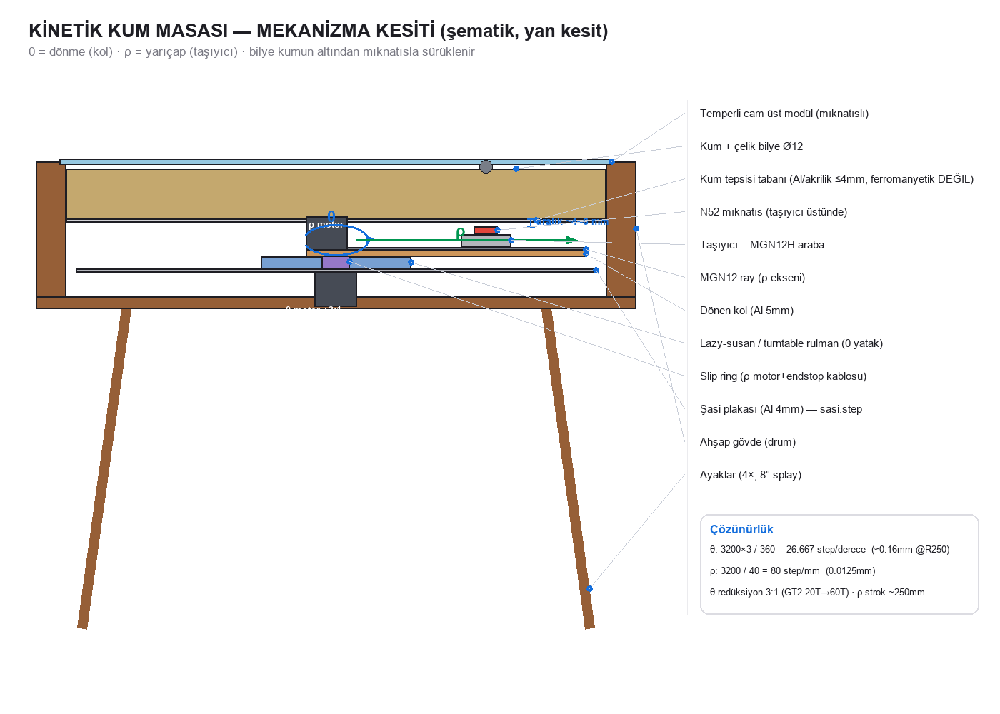

# Mekanizma Tasarımı — polar (θ-ρ) kinetik sürücü

Bilyeyi kumun altından mıknatısla sürükleyen **dönen-kol (rotating arm)** mekanizması.
Sisyphus/Dune Weaver tipi. Mevcut **kontrol kartı** (J3 = ρ motor, J5 = endstop) ve **FluidNC**
(X = ρ, A = θ) ile **tutarlı** tasarlanmıştır.



## 1) Mimari ve katman dizilimi (alttan üste)
```
   ┌─ cam (temperli Ø552)                              ← sabit (üst modül, mıknatıslı)
   │   kum + çelik bilye (Ø12 krom)                    ← sabit tepsi içinde
   ├─ KUM TEPSİSİ tabanı (alüminyum/akrilik ≤4mm, ferromanyetik DEĞİL)  ← sabit
   │      ↕ hava aralığı ~4–6 mm   (manyetik kuplaj)
   │   ┌ MIKNATIS (N52) — taşıyıcı üstünde
   │   ├ TAŞIYICI (MGN12H araba) ── MGN12 RAY ─────────  ← DÖNEN kol üstünde (ρ ekseni)
   ├─ DÖNEN KOL (Al 5mm)  + ρ motoru (NEMA17, kolda) + GT2 kayış
   ├─ LAZY-SUSAN / turntable rulman (Ø100–150)          ← θ dönme yatağı
   ├─ ŞASİ plakası (Al 4mm, sabit)                       ← sasi.dxf/step
   │   θ motoru (NEMA17, şasi altında) + GT2 redüksiyon
   │   SLIP RING (kapsül, merkez) — ρ motor+endstop kablosu döner tarafa
   └─ kontrol kartı + 12V SMPS (şasi altı/yanı)
```

## 2) θ ekseni (dönme)
- **Yatak:** Lazy-susan / turntable rulman (Ø100–150 mm) veya ince-kesit bilyalı rulman.
  Kolu + ρ tertibatını taşır, merkezde slip ring için **boşluk** (Ø≥40).
- **Tahrik:** NEMA17 → **GT2 kayış**, motor kasnağı **20T** → eksen kasnağı **60T** = **3:1 redüksiyon**.
  (tork + çözünürlük artışı; ucuz, geri boşluksuza yakın).
- **Çözünürlük:** 1.8° motor × 16 µstep = 3200 step/dev × 3 = **9600 step / kol turu** → **26.667 step/derece**.
  R=250 mm'de yay çözünürlüğü = 2π·250·(0.0375°/360) ≈ **0.16 mm** (sub-mm ✓).
- **Sürekli dönme:** FluidNC **A** ekseni limitsiz; slip ring kabloyu sınırsız tur sağlar.

## 3) ρ ekseni (yarıçap)
- **Ray:** **MGN12** lineer ray (kol boyunca), **MGN12H** araba = taşıyıcı.
- **Tahrik:** kolun pivot ucunda **NEMA17** (kolla birlikte döner) → **GT2 kapalı kayış** → taşıyıcı.
  Kasnak **20T** = 40 mm/dev.
- **Çözünürlük:** 3200 step/dev / 40 mm = **80 step/mm** → 0.0125 mm/step (✓).
- **Strok:** 0 → R_max ≈ **250 mm** (ray ~280 mm). Merkez ucunda **endstop** (ρ home).
- FluidNC **X**: `steps_per_mm: 80`, `max_travel_mm: ~250`.

## 4) Slip ring (dönen tarafa güç+sinyal)
ρ motoru kolla döndüğü için kablosu **kapsül slip ring**'ten geçer (merkez ekseninde):
- **Geçen iletkenler:** ρ motor 4 (A+,A−,B+,B−) + endstop 2 = **6 hat** → **8–12 yollu, ≥2A** kapsül slip ring (Ø12.5).
- Sürücüler **bazda** (ana PCB): J3 → slip ring → ρ motor; J5 → slip ring → endstop. **PCB ile tutarlı.**
- LED **sabit** rim'de → slip ring **gerekmez**.

## 5) Mıknatıs ve kuplaj
- **Mıknatıs:** N52 **Ø20×10** (veya Ø15×8), taşıyıcı üstünde, kutup yukarı.
- **Aralık:** tepsi tabanı (≤4 mm, **ferromanyetik değil**) + hava ~4–6 mm = toplam ~8–10 mm.
- **Bilye:** Ø12 krom çelik. Bu aralıkta N52 Ø20×10 çekme kuvveti ≫ ince kumda sürükleme direnci
  (tipik <1 N orta hızda) → güvenli kuplaj. Aralık büyürse mıknatısı büyüt / kademe yap.

## 6) Hesap özeti
| Büyüklük | Değer |
|---|---|
| θ step/derece | **26.667** (3200×3 / 360) |
| θ çözünürlük @R250 | **0.16 mm** |
| ρ step/mm | **80** (3200 / 40) |
| ρ çözünürlük | **0.0125 mm** |
| ρ strok | ~250 mm |
| θ redüksiyon | 3:1 (20T→60T GT2) |
| Motor | 2× NEMA17 (1.8°, ~0.4 N·m), TMC2209 ~0.6–0.9A |

## 7) Yükseklik / sığma bütçesi (drum gövdesi ~147 mm)
Şasi 4 + lazy-susan ~10 + kol 5 + ray+araba ~21 + mıknatıs/aralık ~10 ≈ **50 mm** (tepsi altına).
θ motoru şasi **altında** (34 mm). **ρ motoru (34 mm) kolda** en yüksek öğe → ya kol ucunda yana
sarkıtılır ya gövde yüksekliği buna göre. → **Doğrulanacak fit kalemi.**

## 8) Eklenecek BOM (mekanizma)
| Parça | Örnek | TR tedarik |
|---|---|---|
| Lazy-susan/turntable rulman Ø100–150 | turntable bearing | yatak/robotik satıcı |
| GT2 kayış + kasnak 20T/60T + idler | 6 mm GT2 set | Robotistan/Motorobit |
| MGN12 ray + MGN12H araba (~300 mm) | MGN12 | lineer hareket satıcı |
| Kapsül slip ring 8–12 yol ≥2A | Ø12.5 kapsül | robotik/otomasyon |
| N52 mıknatıs Ø20×10 | neodyum | yurtiçi neodyum |
| Krom çelik bilye Ø12 | bilye | rulman/bilye satıcı |

## 9) Firmware tutarlılığı (`../../firmware/fluidnc_config.yaml`)
- **A (θ):** `steps_per_mm: 26.667`, sürekli (`max_travel` büyük).
- **X (ρ):** `steps_per_mm: 80.0`, `max_travel_mm: 250`, `limit_neg_pin` (endstop, slip ring'den).
- `.thr` (θ rad, ρ 0..1) → G-code: **A = derece**, **X = ρ × 250 mm**.

## 10) Riskler ve doğrulama
| Risk | Önlem / doğrulama |
|---|---|
| θ yatak boşluğu/salınımı → desen kayması | kaliteli ince-kesit rulman; kayış gerginliği |
| ρ motoru kolda yükseklik | fit testi (gövde yüksekliği vs motor) — **Fusion'da STEP ile doğrula** |
| slip ring gürültü/kontak | ≥2A kaliteli kapsül; ρ akımını düşük tut |
| mıknatıs aralığı büyük → bilye kaçar | aralığı ≤10 mm tut; gerekirse mıknatıs büyüt; hız limiti |
| kuplaj hızda kopar | max_rate'i kalibrasyonda bul (FluidNC) |

> **Sonraki adım:** bu mimariyi **Fusion 360**'a aktar (STEP + COTS: MGN12, lazy-susan, slip ring,
> NEMA17 modelleri) → fit/çakışma + yükseklik bütçesini doğrula. Bu doküman o doğrulamanın girdisidir.
