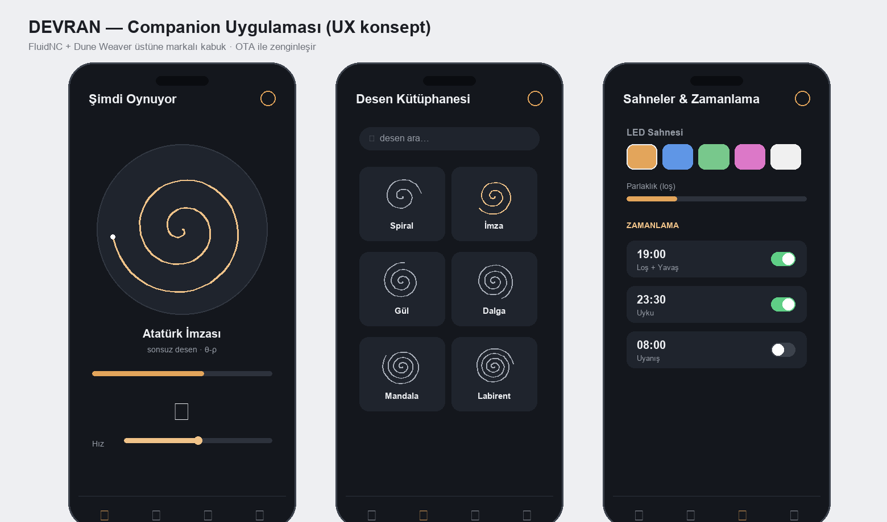

# Pazara Çıkış (GTM) + Companion Uygulama UX

Premium tasarım objesini nasıl konumlandırıp satarız + "akıllı obje" deneyimini tanımlayan
uygulama konsepti. Global donanım/tasarım şirketi yaklaşımı.

## 1) Konumlandırma
**DEVRAN** = *yaşayan sanat eseri* — dekoratif obje + sakinleştirici hareket + ışık.
Hedef his: Teenage Engineering'in tasarım disiplini + Sisyphus'un sükûneti, **yerli üretim** hikâyesiyle.

- **Birincil kitle:** tasarım-bilinçli premium ev sahibi, koleksiyoner, hediye alıcısı.
- **İkincil:** otel/lobi/ofis (kurumsal), galeri/konsept mağaza.
- **Mesaj:** "Kumun üstünde kendiliğinden çizilen, hiç tekrarlamayan sanat."

## 2) Kanal stratejisi
| Kanal | Rol |
|---|---|
| **Kickstarter / crowdfunding** | donanımda standart lansman — talep doğrula + ön finansman + topluluk |
| **D2C web (ön-sipariş + checkout)** | ana marj kanalı; mevcut site → e-ticaret'e |
| **Tasarım perakende / galeri / konsept mağaza** | premium konumlandırma + görünürlük |
| **Kurumsal/hediye** | yüksek sepet, B2B |

## 3) Fiyat katmanları
| Katman | İçerik | Fiyat (hedef) |
|---|---|---|
| Early bird (Kickstarter) | ilk parti, indirimli | ~17.900 ₺ / ~$530 |
| Standart | ceviz + temperli cam | **21.900 ₺ / ~$650** |
| Signature/limited | özel finiş + plaka + ekstra desen | ~28.900 ₺ / ~$850 |
| (Aksesuar) | ekstra desen paketi, özel kum | düşük marj-yükseltici |

Seri COGS ~7.800 ₺ → standart katmanda ~%64 brüt marj. İade rezervi (~%3) + garanti (~%8) fiyata içkin.

## 4) Lansman zaman çizelgesi (kaba)
1. **Prototip + gerçek foto/film** (ön koşul — render değil)
2. **Kitle ön-ısıtma** (landing + e-posta listesi + sosyal teaser)
3. **Kickstarter** (30 gün) — hedef X adet
4. **Üretim (PVT→seri)** + **CE/FCC** paralel
5. **Teslim + D2C açılışı** + perakende/galeri görüşmeleri
6. **Topluluk deseni** + sürüm güncellemeleri

## 5) Ölçütler (global pro takip eder)
Dönüşüm oranı, CAC, AOV, iade %, NPS, üretim verimi (yield), birim marj, Kickstarter dönüşümü.

---

## 6) Companion uygulama UX (konsept)
"Akıllı obje" deneyimi — Sisyphus/Dune Weaver seviyesinde, marka diliyle:

| Ekran | İşlev |
|---|---|
| **Şimdi oynuyor** | canlı desen önizleme + ilerleme, hız, LED sahnesi, oynat/duraklat |
| **Desen kütüphanesi** | yerleşik + topluluk `.thr`; favori, kategori |
| **Sahneler** | LED modu (idle/playing/scheduled), renk, parlaklık |
| **Zamanlama** | "akşam 19:00 loş + yavaş", uyku/uyanma |
| **Cihaz** | Wi-Fi, OTA güncelleme, kalibrasyon, durum/sağlık |
| **Stüdyo** | görüntü/yazı → desen (image→.thr), paylaş |

**İlkeler:** sessiz/sakin arayüz, premium tipografi, tek elle erişim, OTA ile zamanla zenginleşen
özellikler (yazılım değeri). Teknik altyapı **FluidNC + Dune Weaver** üstüne markalı bir kabuk.

> Ekosistem = donanım marjı + **yazılım/desen pazarı** (tekrar gelir + topluluk = savunma hattı,
> çünkü donanım kolay kopyalanır).
